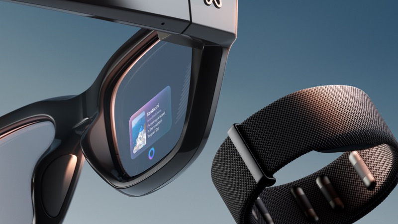
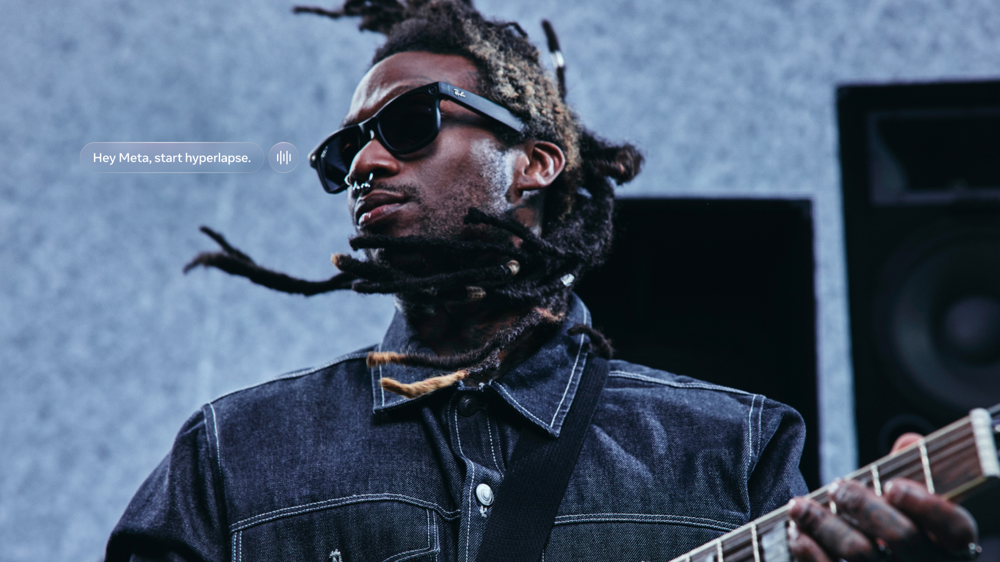

# Ved Nikolic

**AI Experiences PM**

I build the experience layer where AI meets real users under real constraints. At Meta, I lead capture across AI glasses including Meta Ray-Ban Display, Ray-Ban Meta (Gen 1 and 2), Oakley Meta HSTN, and Oakley Meta Vanguard, partnering with the AI team on ML models from ideation through production. At Best Buy, I delivered $50M+ incremental revenue by rebuilding the recommendation architecture on an ML foundation. Earlier I founded a consultancy delivering 0-to-1 solutions across fintech, blockchain, and e-commerce in four countries. I sharpen my craft through open source: evaluation methodology, a knowledge graph, automated eval loops, and adversarial analysis frameworks.

<div align="center">


</div>

---

## What I Build at Meta

Led the media capture user experience across Meta's AI wearable devices. Drove capture to the **#1 feature and #1 purchase driver** on Meta's AI glasses with majority user awareness and best-in-class engagement. Partnered with AI team on ML models from ideation through production handoff. Shifted to in-house media processing, achieving **sub-second latency and >99% success rate** across 7+ device SKUs. Shipped the largest feature expansion in capture history ahead of schedule. Scaled product support **3x** across multiple product lines.

<div align="center">

| | |
|:---:|:---:|
|  |  |

</div>

---

## Open Source Tools

I build tools that solve real problems in AI product development. All open source, all LLM-agnostic.

<table>
<tr>
<td width="50%" valign="top">

### [Cortex](https://github.com/vednikolic/cortex)
 

The memory layer AI coding tools ship without. Routes session context to structured destinations and surfaces cross-project patterns via a knowledge graph.

```
cortex save "chose connection pooling over per-request"
cortex reflect  # surfaces patterns across all projects
```

</td>
<td width="50%" valign="top">

### [Evalgate](https://github.com/vednikolic/evalgate)
 

Evaluation methodology and tooling for AI products. Schema normalization, constraint gates, variance-aware regression detection, and cost/quality measurement across models.

```
Principles from hundreds of LLM evals:
- Atomic evals (one assertion per check)
- Constraint gates (one failure = zero score)
- LLM-as-judge variance: 5-7.5%
```

</td>
</tr>
<tr>
<td width="50%" valign="top">

### [PM AutoResearch](https://github.com/vednikolic/pm-autoresearch)
 

Automated eval loop for product documents. Define binary pass/fail criteria, iterate, keep only improvements. Git tracks every round.

```
Score: 17% --> 94% (4 rounds)
Evals: 19 binary criteria, locked harness
```

</td>
<td width="50%" valign="top">

### [Red-Team](https://github.com/vednikolic/red-team)
 

Adversarial analysis from 12 disciplinary lenses. Point it at any product artifact and get severity-ranked findings with grounding and worst-case scenarios.

```
Agents: Engineering, UXR, PMM, Privacy,
Legal, Ethics, Security, Finance, Data,
Design, Ops, Localization
```

</td>
</tr>
<tr>
<td width="50%" valign="top">

### [Steelman](https://github.com/vednikolic/steelman)
 

The counterpart to red-team. Takes weaknesses and converts them into positioning advantages through 6 analytical lenses.

```
Lenses: Strengthen weakest argument,
Reframe positioning, Evidence,
Expand moat, Simplify, Second-order
```

</td>
<td width="50%" valign="top">

### [Stakeholder Radar](https://github.com/vednikolic/stakeholder-radar)
 

Evidence-based stakeholder profiles from real artifacts. Simulates document reviews before they happen.

```
Input: meeting notes, Slack threads,
emails, doc comments, review threads
Output: per-reviewer predictions with
evidence and confidence levels
```

</td>
</tr>
</table>

---

## How I Work

```
  FIND THE REAL             DEFINE WHY                   STRESS-TEST                  SHIP ACROSS
  CONSTRAINT                BEFORE HOW                   BEFORE BUILDING              BOUNDARIES
  ---------------           ---------------              ---------------              ---------------

  Sub-second latency,       The spec defines what        A/B tested every             $50M+ across Best Buy.
  >99% success at Meta.     good looks like. That        feature across wearable      3x scale across 4+
  400% attach rate at       clarity shipped the          hardware, AI models,         orgs at Meta. 0-to-1
  Best Buy. The problem     largest expansion in         and companion software.      across 4 countries.
  is rarely what it         Meta capture history         $9M+ reco experiments        100% growth across
  looks like.               ahead of schedule.           at Best Buy. 12 lenses.      6 markets.
```

---

## Connect

<div align="center">

[](mailto:ved@vednikolic.com)
[](https://linkedin.com/in/vednikolic)
[](https://vednikolic.com)

</div>
